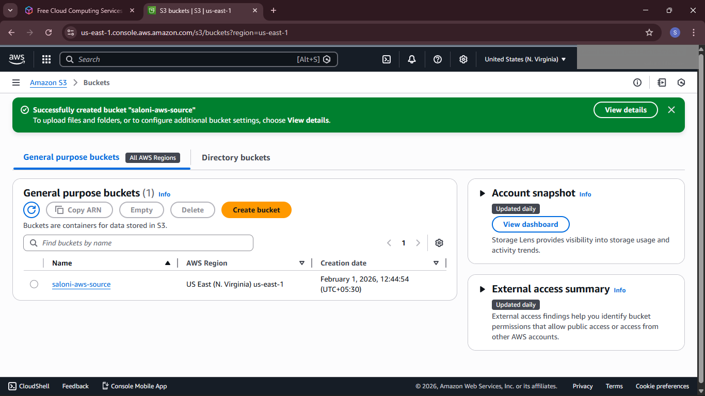
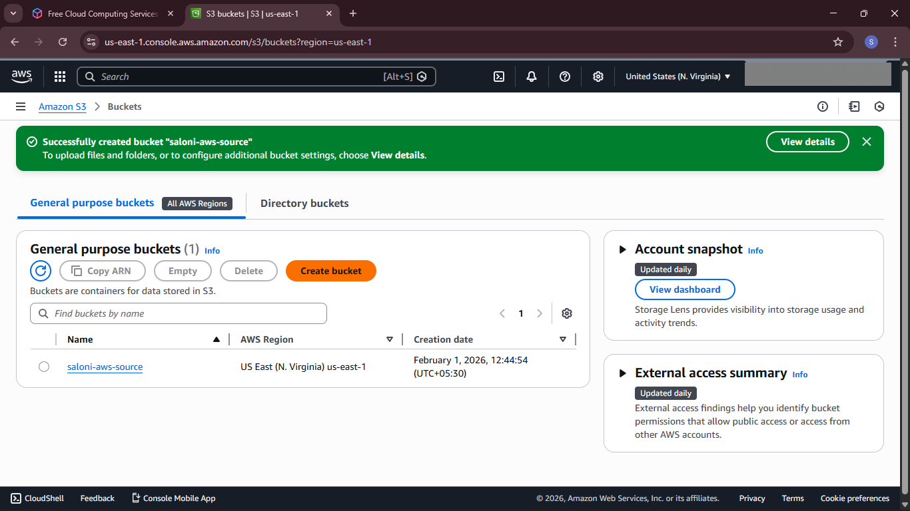
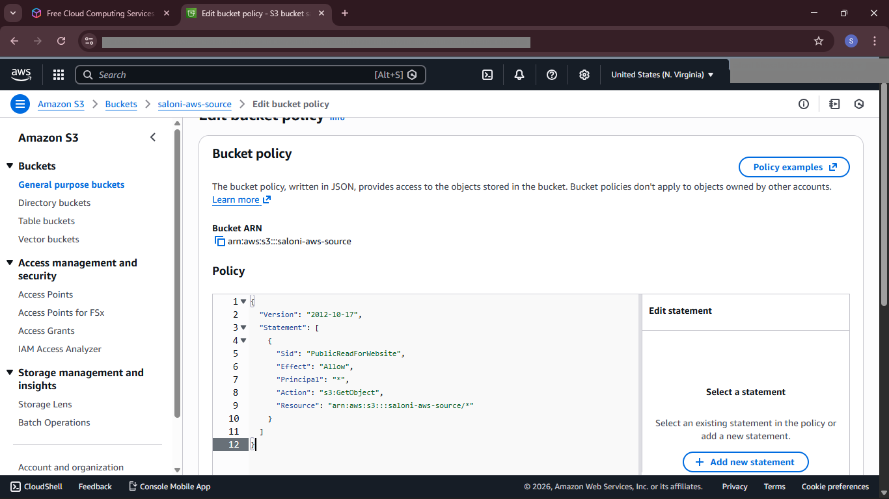
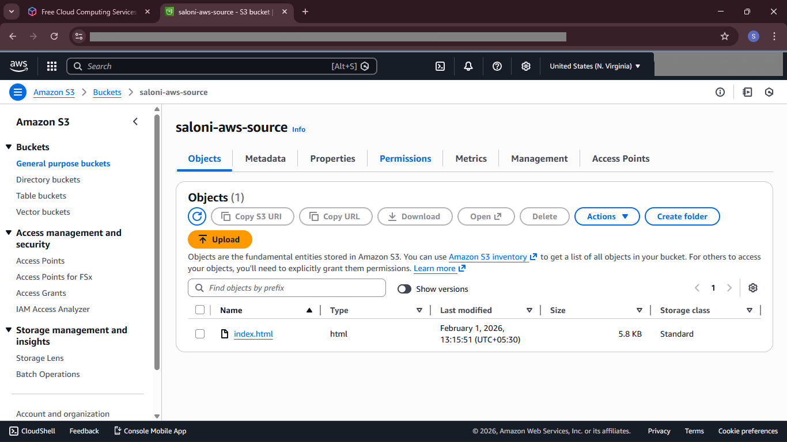
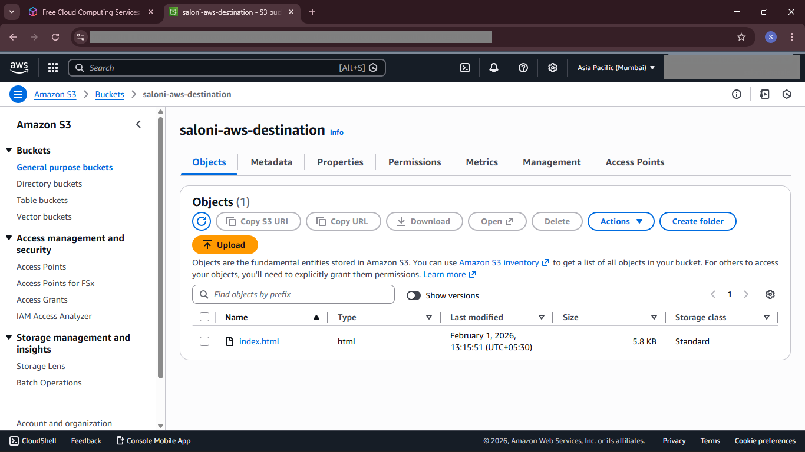

# 🌐 AWS S3 Static Website Hosting with Cross-Region Replication


## 📖 Project Overview

This project demonstrates how to host a **static website** using **Amazon S3 Static Website Hosting** and improve availability through **Amazon S3 Cross-Region Replication (CRR)**.

The website is hosted from a **Source S3 Bucket**, while all website files are automatically replicated to a **Destination S3 Bucket** in another AWS Region. This architecture provides improved availability, redundancy, and disaster recovery.

---

# 🎯 Objectives

- Deploy a static website using Amazon S3
- Configure public access securely
- Enable Static Website Hosting
- Configure Bucket Policies
- Enable Versioning
- Configure Cross-Region Replication (CRR)
- Verify automatic replication between AWS Regions

---

# 🛠 Technologies Used

- Amazon S3
- Cross-Region Replication (CRR)
- IAM
- Bucket Policies
- Versioning
- Static Website Hosting
- HTML
- CSS
- AWS Management Console

---

# ✨ Features

- Static Website Hosting
- Public Website Access
- Source & Destination Buckets
- Bucket Policy Configuration
- Bucket Versioning
- Cross-Region Replication
- Automatic Object Replication
- Disaster Recovery Architecture

---

# ⚙ Project Workflow

### Step 1
Created the Source Amazon S3 Bucket.

### Step 2
Uploaded the website files (HTML & CSS).

### Step 3
Enabled Static Website Hosting.

### Step 4
Configured Bucket Policy for public access.

### Step 5
Enabled Bucket Versioning.

### Step 6
Created the Destination Bucket in another AWS Region.

### Step 7
Configured IAM Role for replication.

### Step 8
Configured Cross-Region Replication (CRR).

### Step 9
Verified successful replication of website objects.

### Step 10
Accessed the website using the S3 Website Endpoint.

---

# 🏗 Architecture

```text
                    User
                     │
                     ▼
         Amazon S3 Static Website
             (Source Bucket)
                     │
                     │ Cross-Region Replication
                     ▼
         Destination S3 Bucket
            (Replica Bucket)
```

---

# 📸 Project Screenshots

## 🖥 Website Home Page


---

## 📦 Source Bucket



---

## 🌎 Destination Bucket



---

## 🌐 Static Website Hosting


---

## 🔐 Bucket Policy



---

## 🔄 Cross-Region Replication Rule


---

## ✅ Cross-Region Replication Verification

**Source Bucket (Primary Region)** | **Destination Bucket (Replica Region)**





**Objects Successfully Replicated Using Amazon S3 Cross-Region Replication (CRR).**

---

# 📚 Learning Outcomes

Through this project, I gained practical experience with:

- Amazon S3
- Static Website Hosting
- Bucket Policies
- Bucket Versioning
- Cross-Region Replication (CRR)
- IAM Roles
- Public Access Configuration
- AWS Cloud Storage
- Disaster Recovery Concepts

---

# 🚀 Future Enhancements

- Deploy using Amazon CloudFront
- Configure a custom domain with Route 53
- Enable HTTPS using AWS Certificate Manager (ACM)
- Add CI/CD using GitHub Actions
- Automate deployment using Infrastructure as Code (Terraform)

---

# 👩‍💻 Author

**Saloni Bhosale**

- 💼 LinkedIn: https://www.linkedin.com/in/saloni-bhosale-039642346
- 💻 GitHub: https://github.com/salonii2002

---

⭐ If you found this project useful, consider giving it a **Star**.
